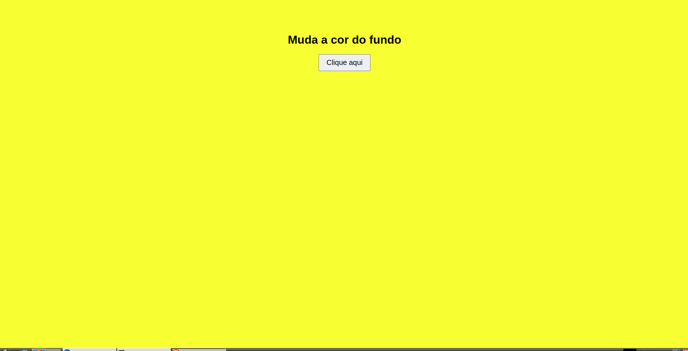

# 🎨 Muda-Cor

Um projeto simples feito com HTML, CSS e JavaScript.  
Clique no botão para mudar a cor de fundo da página!



[](https://github.com/hebertedu-dev/muda-cor)

---

## 📌 Objetivo

Aprender e praticar:

- HTML básico
- CSS para estilização
- JavaScript para interação
- Git + GitHub para versionamento de código
- Tudo isso usando apenas o Vim 😎

---

## 💻 Como usar

1. Clone o repositório:
   ```bash
   git clone https://github.com/HebertEdu/muda-cor.git
   cd muda-cor

